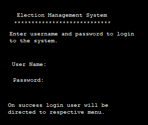
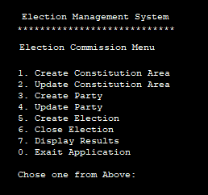
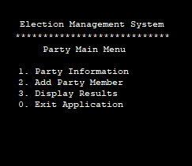
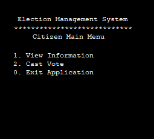

# EMS 360
3rd Semester project, developing application Election Management System, the project have the following main features,.

## Features

* Election Commission (Responsable for the following)
* Constitution (Area are devided into multiple constitutions)
* Parties (Multiple parties are registered in multiple constitutions)
* Login (User are distribute in three majour parts, i.e. Voter, Party Memmber and Elecion Commission Member) 

## Explanation
Election commission is responsable to create constitution or define areas, a unique code is assign to each constitution, then party is created with admin user, a Party admin user can create multiple user corresponding to specific constitution, only one candidate can be created agains any constitution, then election commssion is registring voters to a certain constitution. Finnally election commission is responsable for conducting election, a voter can cast vote only one time.

## Application Screens

* User will login, based on role the following menu will display.
* User Login

* Election Commission Main Menu

* Party Main Menu

* Citizen or Voter Main Menu

## Wrokflow

(Workflow)

## Contributes

* Saliha Durrani
* Aiman Jamil
* Muhammad Ahmad
* Zeeshan Ahmad Khan
